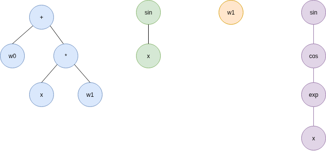
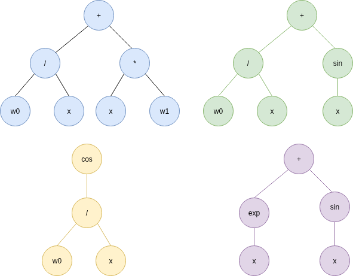

Initialization
==============

.. _initialization:

QuickSR supports 3 different ways to fill the initial population.

Grow Initialization
-------------------

This initialization strategy generates individuals by randomly selecting terminals and functions
until the maximum depth is reached or until a terminal is chosen. The resulting trees have varying 
structure and size. Usage:

.. code-block:: python3

   model = SymbolicRegressionModel(...,
        initialization=GrowInitialization())

The smallest depth is one, meaning that some individuals can consist of just a terminal.

The maximum depth is normally determined by the global configuration, which is also the highest depth
to which expressions can ever grow. However, this upper bound may be considered too high for 
initialization. Therefore, the initial maximum depth can be overriden using the `init_depth` parameter:

.. code-block:: python3

   model = SymbolicRegressionModel(...,
        initialization=GrowInitialization(init_depth=4))

Here is an example population generated with grow initialization (depth 4):

Full Initialization
-------------------

This initialization strategy generates individuals by randomly selecting functions and terminals
until the maximum depth is reached in every branch of a generated tree. The resulting trees are 
fully grown. All of the generated expressions have the exact same depth. Usage:

.. code-block:: python3

   model = SymbolicRegressionModel(...,
        initialization=FullInitialization())

Similar to the previous case, the depth is normally inherited from the global configuration,
but this can be overriden by explicitly specifying an `init_depth` value:

.. code-block:: python3

   model = SymbolicRegressionModel(...,
        initialization=FullInitialization(init_depth=3))

Here is an example population generated with full initialization (depth 3):

Ramped Half and Half Initialization
-----------------------------------

Half of the initial population consist of individuals produced by Grow Initialization,
while the other half consist of individuals produced by Full Initialization. Usage:

.. code-block:: python3

   model = SymbolicRegressionModel(...,
        initialization=RampedHalfAndHalfInitialization())

`init_depth` can be used override maximum depth as before: