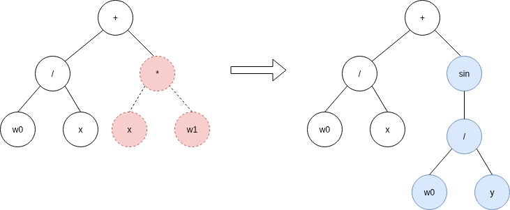
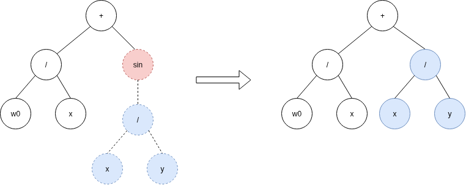
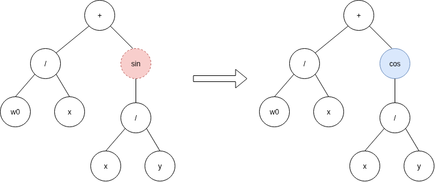

Mutation
========

.. _mutation:

QuickSR supports 4 mutation operators.

Subtree Mutation
----------------

This mutation strategy randomly selects a subtree in the expression.
The selected subtree is then replaced by another randomly generated subtree.
This allows for significant changes in the expression structure, potentially leading to new solutions.

* The `max_depth_increment` parameter controls the maximum depth of the inserted subtree. This helps in controlling the complexity of the expressions and prevents excessive growth. Default is 3 if not provided.
* The `mutation_probability` parameter determines the likelihood of applying the mutation to an individual. Default is 0.7 if not provided.

Usage:

.. code-block:: python3

    mutation=SubtreeMutation(
        max_depth_increment=3,
        mutation_probability=0.7
    )

An example of how subtree mutation is performed with `max_depth_increment` = 3:

*Note that the new subtree (shown in blue) could have had a depth less than three. Three is just an upper bound.*

Hoist Mutation
--------------

This mutation strategy randomly selects a subtree from the expression and replaces it
with a randomly chosen, smaller subtree within that subtree. This can lead to expressions
becoming more simple, fighting the bloat problem.

* The `mutation_probability` parameter determines the likelihood of applying the mutation to an individual. Default is 0.7 if not provided.

.. code-block:: python3

   mutation=HoistMutation(mutation_probability=0.7)

Point Mutation
--------------

This mutation strategy randomly selects a node in the expression.

If the selected node is a terminal (constant, variable, parameter), it is replaced 
by another randomly generated terminal.

If the selected node is a unary operation (sin, cos, exp, relu), it is replaced by another randomly 
chosen unary operation, while its sole operand (child) is preserved.

If the selected node is a binary operation (+, -, \*, /), it is replaced by another randomly 
selected binary operation, while both of its operands (children) are preserved.

This strategy explores new functions without growth in the complexity of the expressions.

* The `mutation_probability` parameter determines the likelihood of applying the mutation to an individual. Default is 0.7 if not provided.

.. code-block:: python3

    mutation=PointMutation(mutation_probability=0.7)

Distribution Mutation
---------------------

This mutation strategy randomly applies one of several mutation strategies at every mutation operation according to the specified probabilities.

Parameters
 * `mutations` List of mutation strategies to be applied.
 * `probabilities` List of probabilities corresponding to each mutation strategy.

.. code-block:: python3

    mutation=DistributionMutation(
        [SubtreeMutation(), HoistMutation(), PointMutation()], 
        [0.5, 0.25, 0.25]
    )
