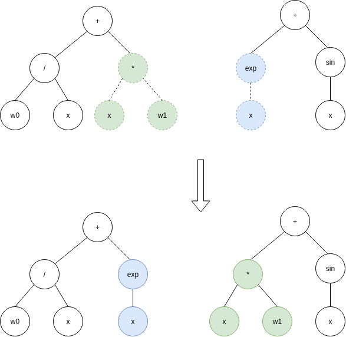

Recombination
=============

.. _recombination:

Default Recombination
---------------------

A random subtree from each parent is selected and swapped to create new offspring. 

The `crossover_probability` parameter determines the likelihood of applying the crossover to a pair of individuals. The default value is 0.8 if not specified.

.. code-block:: python3

   recombination=DefaultRecombination(crossover_probability=0.8)

Below is an example of default recombination:

