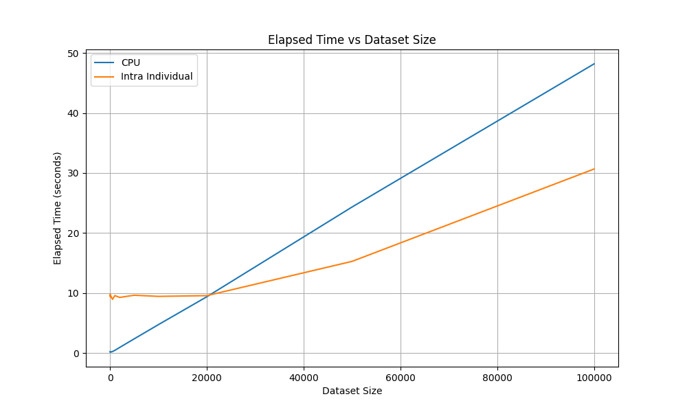
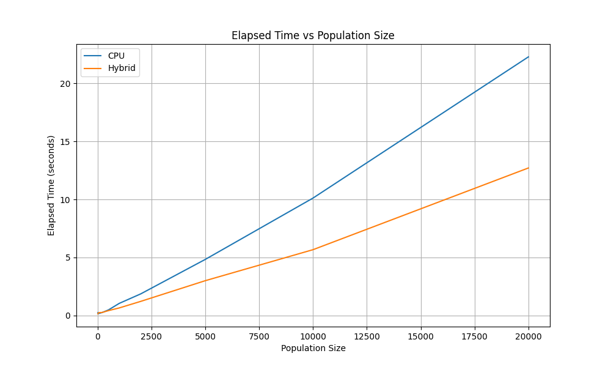

Runners
=======

.. _runners:

A runner in QuickSR evaluates a collection of expressions for loss and learns the trainable parameters in them through gradient descent. As of now, there are four runners in QuickSR. This section explains what they are and how they work.

CPU Runner
----------

The CPU runner evaluates and trains given expressions entirely on the CPU. When this runner is used, every island evaluates its population on a separate CPU core. For some operations, SIMD instructions of the CPU may also be utilized. Usage:

.. code-block:: python3

   model = SymbolicRegressionModel(...,
        runner_generator=CPURunnerGenerator())

GPU Runners
-----------

The GPU runners evaluate and train expressions on the GPU, where each island evaluates its population on a separate HIP stream. While multiple streams, on its own, already provides some task parallelism, further task and data parallelism are achieved by three different decompositions.

Inter-individual GPU Mode
^^^^^^^^^^^^^^^^^^^^^^^^^

In the inter-individual GPU mode, parallelization is done over individuals. A single kernel is launched on the stream associated with an island. Every GPU thread processes a different individual's bytecode program. When the loss computation/gradient accumulation from one data point is done, the threads move on to the next data point in a sequential loop. The loop over epochs is also moved inside the kernel, eliminating kernel launch overhead. There is no data parallelism.

.. code-block:: python3

   model = SymbolicRegressionModel(...,
        runner_generator=InterIndividualRunnerGenerator())

Likely due to control flow divergence within a wave/warp, no performance benefits were observed with this mode when compared against the CPU-only implementation. This mode is included for completeness.

Intra-individual GPU Mode
^^^^^^^^^^^^^^^^^^^^^^^^^

The intra-individual GPU mode parallelizes over data points. For each individual, a new kernel is launched on the stream associated with the individual's island. The kernel executes the same bytecode program over all data points in parallel. The losses and gradients from different data points are computed by different threads, so the final results are obtained by reduction summation on the GPU. After one individual is done, the next one is processed in a sequential loop. There is no task parallelism within an island.

.. code-block:: python3

   model = SymbolicRegressionModel(...,
        runner_generator=IntraIndividualRunnerGenerator())

This mode provides speedup over CPU as the dataset size gets larger.

Hybrid GPU Mode
^^^^^^^^^^^^^^^

The hybrid GPU mode parallelizes over both individuals and data points. A single kernel is launched with number of threads equal to 32 times the number of individuals per island. Every consecutive set of 32 threads (wave/warp) run the same bytecode program for different data points, with a sequential stride loop over the dataset for the remaining data points. The loop over epochs is also moved inside the kernel, eliminating kernel launch overhead.

.. code-block:: python3

   model = SymbolicRegressionModel(...,
        runner_generator=HybridRunnerGenerator())

This mode provides speedup over CPU as the population size gets larger.

Terminology
-----------

Why "Intra" and "Inter"?
^^^^^^^^^^^^^^^^^^^^^^^^

The terms "inter-individual" and "intra-individual" were borrowed from the `evoGP paper (2025) <https://arxiv.org/abs/2501.17168>`_, which evaluates prior symbolic regression frameworks and their own work in terms of different ways to parallelize symbolic regression on NVIDIA GPUs. 

Why "RunnerGenerator" instead of "Runner"?
^^^^^^^^^^^^^^^^^^^^^^^^^^^^^^^^^^^^^^^^^^

This naming of the classes is due to the way the codebase is internally organised. A runner is an object that must be associated with a specific CPU thread and a HIP stream when created, but at this point, we haven't created any threads or streams. We just specify that, we want this type of runner to be created for every single island, and the runner generator classes do that.